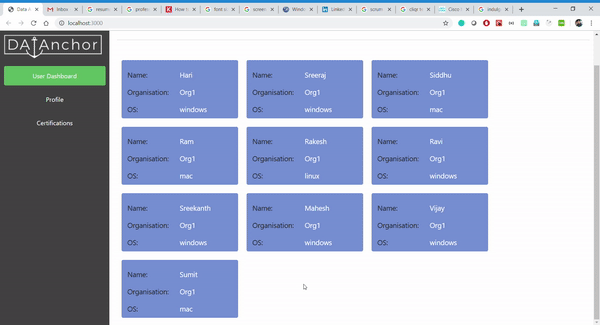

# react-webapp
It's a simple dashboard of users with their machine details.
Machine can be of any OS(Mac, windows or linux) and we simulate file explorer behaviour -> folder/file navigation

run server
`node react-webapp/my-app/src/server/server.js`

